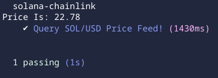

# solana-chainlink

## deployed

[devnet](https://explorer.solana.com/address/4YVHiLzdjBNDQnHc5geB3Y2tGABZwzhZLqXCZMCW4QMZ?cluster=devnet)

## set-up

- `npm i --save-dev @types/moch`

- `yarn install`

- `solana-keygen new -o id.json`

- ` solana-keygen pubkey id.json`

- `solana airdrop 2 $(solana-keygen pubkey ./id.json) --url https://api.devnet.solana.com && solana airdrop 2 $(solana-keygen pubkey ./id.json) --url https://api.devnet.solana.com`

- `anchor build`

- get the program id from: `solana address -k ./target/deploy/solana_chainlink-keypair.json`

- `anchor build`

- `anchor deploy --provider.cluster devnet`

- `anchor test`

## TESTS COVERAGE

 

</a>

 
